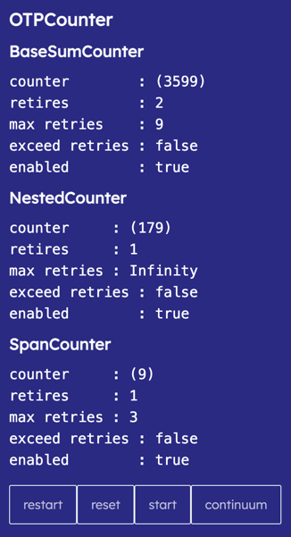

# OTP Counter



[demo](https://gordianknotc.github.io/otp_counter/)

由二種 counter 組成
- BaseNestedCounter 
- BaseSpanCounter

BaseNestedCounter 繼承 BaseNestedCounter，內可巢狀一個 BaseSpanCounter | BaseNestedCounter, BaseSpanCounter 則實作基本羅輯， 
設計用於雙重 counter 條件，如：

> __定義:__
>
> 於 period 其間可進行 pt 次倒數, 於 span 其間可進行 st 次倒數, 當 period 再次計數後 span 重設, 
>


__實例:__
- otp counterA, 於 3分鐘可重試3次，每次間隔 10 秒內，一天最多9次
  - BaseSumCounter 間隔 1d，maxRetries 9
    - NestedCounter 間隔 3min，maxRetries INFINITY
      - SpanCounter 間隔 span 10s， maxRetries 3


- email counter, 5分鐘可重試5次，每次間隔 10 秒內
  - NestedCounter 間隔 period 5min， maxRetries 1
    - SpanCounter 間隔 span 10s， maxRetries 5


## Examples:
### EmailCounter
```ts
export class VerifEmailSpanCounter extends  BaseSpanCounter{
  constructor(key: string = 'EmailSpanCounter') {
    super({
      maxTimes: 2,
      span:     10,
      storeKey: key
    });
  }
  protected afterCancel(): void {}
  protected afterSet(lbound: number): void {}
}

export class VerifyEmailCounter extends BaseNestedCounter{
  constructor(key: string = 'EmailCounter') {
    super({
      maxTimes:  3,
      period: 30,
      nestedCounter: new VerifEmailSpanCounter(),
      storeKey: key,
    });
    console.log("Period:", this.state.span, "option:");

  }

  protected afterCancel(): void {}
  protected afterSet(lbound: number): void {}
}
```

```vue
<template lang="pug">
section.p-4
  section.my-2
    h2.font-bold.text-xl.my-2 EmailCounter
  h2.font-bold.text-lg.my-2 NestedCounter
  pre counter        : {{emailCounterText}}
  pre retires        : {{emailCounter.state.retries}}
  pre max retries    : {{emailCounter.state.maxTimes}}
  pre exceed retries : {{emailCounter.hasExceedMaxRetries.value}}
  pre enabled        : {{emailCounter.counterEnabled}}
  h2.font-bold.text-lg.my-2 SpanCounter
  pre counter     : {{emailSubCounterText}}
  pre retires     : {{emailCounter.nestedCounter.state.retries}}
  pre max retries : {{emailCounter.nestedCounter.state.maxTimes}}
  pre exceed retries : {{emailCounter.nestedCounter.hasExceedMaxRetries.value}}
  pre enabled        : {{emailCounter.nestedCounter.counterEnabled}}
  section.py-4
    van-button(@click="restart")
      span.text restart
    van-button(@click="reset")
      span.text reset
    van-button(@click="start")
      span.text start
    van-button(@click="continuum")
      span.text continuum
</template>

<script lang="ts">
import { ComputedRef, defineComponent, ref, watch } from "vue";
import {VerifEmailSpanCounter, VerifyEmailCounter, VerifyOTPCounter, VerifyOTPPeriodCounter} from "~/store/counter/counter";
import {computed, onMounted} from "~/appCommon/base/vueTypes";
import {BaseNestedCounter} from "~/appCommon/counter/counter_nested";

export default defineComponent({
  name: "CounterDemo",
  components: {
  },
  setup() {
    const emailCounter = new VerifyEmailCounter();
    const emailCounterText = computed(()=>{
      const text =  emailCounter.currentCounter.value;
      const enabled =  emailCounter.counterEnabled.value;
      if (enabled)
        return `(${text})`;
      return "";
    });

    const emailSubCounterText = computed(()=>{
      const text =  emailCounter.nestedCounter.currentCounter.value;
      const enabled =  emailCounter.nestedCounter.counterEnabled.value;
      if (enabled)
        return `(${text})`;
      return "";
    });

    const init = (counter: BaseNestedCounter)=>{
      console.group("MOUNT");
      if (counter.counterEnabled.value){
        console.log("continue");
        counter.continue();
      }else if (counter.hasExceedMaxRetries.value){
        console.log("restart...");
        counter.reset();
        counter.start();
      }else{
        console.log("start");
        counter.start();
      }
      console.groupEnd();
    }

    onMounted(()=>{
      init(emailCounter);
    });

    return {
      emailCounter,
      emailCounterText,
      emailSubCounterText,
      restart(){
        emailCounter.reset();
        emailCounter.start();
      },
      reset(){
        emailCounter.reset();
      },
      start(){
        emailCounter.start();
      },
      continuum(){
        emailCounter.continue();
      },
    };
  }
});
</script>
```


### OTPCounter
```ts


/** example otp counter */
export class VerifOTPSpanCounter extends  BaseSpanCounter{
  constructor(key: string = 'VerifOTPSpanCounter') {
    super({
      /** 0 代表無限大 */
      maxTimes: 3,
      span:     10,
      storeKey: key
    });
  }
  protected afterCancel(): void {}
  protected afterSet(lbound: number): void {}
}

export class VerifyOTPPeriodCounter extends BaseNestedCounter{
  constructor(key: string = 'VerifyOTPPeriodCounter') {
    super({
      /** 0 代表無限大 */
      maxTimes:  0,
      period: 60 * 3,
      nestedCounter: new VerifOTPSpanCounter(),
      storeKey: key,
    });
  }

  protected afterCancel(): void {}
  protected afterSet(lbound: number): void {}
}

/** Sum counter 計數底層  */
export class VerifyOTPCounter extends BaseSumCounter{
  constructor(key: string = 'VerifyOTPCounter') {
    super({
      maxTimes:  9,
      period: 60 * 60,
      nestedCounter: new VerifyOTPPeriodCounter(),
      storeKey: key,
    });
  }
  protected afterCancel(): void {}
  protected afterSet(lbound: number): void {}
}
```


```vue
<template lang="pug">
section.p-4
  section.my-2
    h2.font-bold.text-xl.my-2 OTPCounter
  h2.font-bold.text-lg.my-2 BaseSumCounter
  pre counter        : {{otpCounterText}}
  pre retires        : {{otpCounter.state.retries}}
  pre max retries    : {{otpCounter.state.maxTimes}}
  pre exceed retries : {{otpCounter.hasExceedMaxRetries.value}}
  pre enabled        : {{otpCounter.counterEnabled}}
  h2.font-bold.text-lg.my-2 NestedCounter
  pre counter     : {{otpSubCounterText}}
  pre retires     : {{otpCounter.nestedCounter.state.retries}}
  pre max retries : {{otpCounter.nestedCounter.state.maxTimes}}
  pre exceed retries : {{otpCounter.nestedCounter.hasExceedMaxRetries.value}}
  pre enabled        : {{otpCounter.nestedCounter.counterEnabled}}
  h2.font-bold.text-lg.my-2 SpanCounter
  pre counter     : {{otpSubSubCounterText}}
  pre retires     : {{otpCounter.nestedCounter.nestedCounter.state.retries}}
  pre max retries : {{otpCounter.nestedCounter.nestedCounter.state.maxTimes}}
  pre exceed retries : {{otpCounter.nestedCounter.nestedCounter.hasExceedMaxRetries.value}}
  pre enabled        : {{otpCounter.nestedCounter.nestedCounter.counterEnabled}}
  section.py-4
    van-button(@click="otp_restart")
      span.text restart
    van-button(@click="otp_reset")
      span.text reset
    van-button(@click="otp_start")
      span.text start
    van-button(@click="otp_continuum")
      span.text continuum
</template>

<script lang="ts">
import { ComputedRef, defineComponent, ref, watch } from "vue";
import {VerifEmailSpanCounter, VerifyEmailCounter, VerifyOTPCounter, VerifyOTPPeriodCounter} from "~/store/counter/counter";
import {computed, onMounted} from "~/appCommon/base/vueTypes";
import {BaseNestedCounter} from "~/appCommon/counter/counter_nested";

export default defineComponent({
  name: "CounterDemo",
  components: {
  },
  setup() {
    const otpCounter = new VerifyOTPCounter();
    const otpCounterText = computed(()=>{
      const text =  otpCounter.currentCounter.value;
      const enabled =  otpCounter.counterEnabled.value;
      if (enabled)
        return `(${text})`;
      return "";
    });

    const otpSubCounterText = computed(()=>{
      const text =  otpCounter.nestedCounter.currentCounter.value;
      const enabled =  otpCounter.nestedCounter.counterEnabled.value;
      if (enabled)
        return `(${text})`;
      return "";
    });
    const otpSubSubCounterText = computed(()=>{
      const text =  (otpCounter.nestedCounter as VerifyOTPPeriodCounter).nestedCounter.currentCounter.value;
      const enabled =  (otpCounter.nestedCounter as VerifyOTPPeriodCounter).counterEnabled.value;
      if (enabled)
        return `(${text})`;
      return "";
    });


    const init = (counter: BaseNestedCounter)=>{
      console.group("MOUNT");
      if (counter.counterEnabled.value){
        console.log("continue");
        counter.continue();
      }else if (counter.hasExceedMaxRetries.value){
        console.log("restart...");
        counter.reset();
        counter.start();
      }else{
        console.log("start");
        counter.start();
      }
      console.groupEnd();
    }

    onMounted(()=>{
      init(otpCounter);
    });

    return {
      otpCounter,
      otpCounterText,
      otpSubCounterText,
      otpSubSubCounterText,
      otp_restart(){
        otpCounter.reset();
        otpCounter.start();
      },
      otp_reset(){
        otpCounter.reset();
      },
      otp_start(){
        otpCounter.start();
      },
      otp_continuum(){
        otpCounter.continue();
      }
    };
  }
});
</script>
```


## Todo
- [V] demo
- [ ] 轉為 ts package
- [ ] 單元測試  


